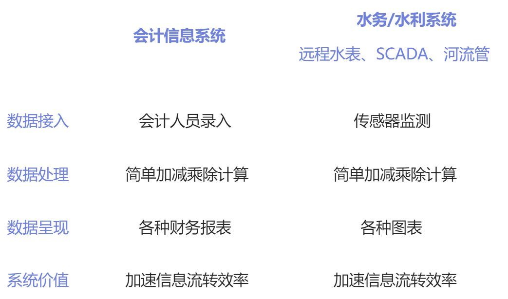

系统，一个与我的读博之旅有着复杂羁绊的东西。假如没有系统，或者说没有参与做系统，我的读博生活必会大不一样。
这里提到的系统，特指水资源管理系统。水资源管理系统属于智慧水务和智慧水利的内容。不仅仅是水资源的管理，很多管理活动都在朝着信息化和系统化的方向发展。
我最早接触的管理系统，应当是会计信息系统，即把会计方法记录的财务信息，用信息化的手段进行记录、存储和分析。会计信息系统背后，是多年以来在会计、财务管理等方面的研究成果，信息化和系统化只是提高了（财务）信息流转的速率。也就是说，会计信息系统是通过提高财务信息的流转速率，提高管理效率的。
那么，水资源管理系统呢？甚至说智慧水务或智慧水利，是怎样提高效率的？
首先，目前绝大多数水利行业的系统，主要发挥宣传的作用，并没有实际应用于生产环境。这里面的代表是数据大屏。可以说，「PPT+数据大屏」可以糊弄住 90% 以上的领导和专家。数据大屏的一个显著特点是，蓝色或黑色的、充满科技感的背景。相信凡是用电脑办公的人，都应该可以想到，任何一个成熟的、可使用的管理系统（软件），会长成数据大屏的样子，所以说，显而易见，这样的数据大屏就只是拿来看的罢了。
但是，这类供人看的，显然不能提高管理效率，但是它也不并非全然没有作用。这类系统最核心的功能在于演示。比如在汇报、跟客户交流等情景下，这里系统就可以发挥它的功能。
其次，水利水务行业也有一些有用的系统。比如供水方面的远程抄表；水厂内部的 SCADA；河长制管理系统等。这类系统也是通过提高信息的流转效率来提供系统整体效率的。远程抄表加速了「每家每户用水量」向供水企业的传递的速率；水厂内部的 SCADA 加速了「控制信号」和「监测的水质指标」在处理单元和管理人员之间的传递速率；河长制管理系统加速了「河流情况」从河流到各级河长的传递效率。
这里，可以把这类系统与会计信息系统做一个对比：

也有一些可能有用的系统，像厂站网河一体化的系统。根据宣传，这类系统希望能基于实时的数据，更加精细化和智能化的管理。一方面，泵站输送水不仅仅只考虑上游来水量，而是同时考虑污水厂的处理能力和污水特性。这在建设一体化系统之前是无法做到的。另一方面，基于最优化理论和动态规划的理论，找到系统内的最优方案，基于实时产生的数据，以更短的时间周期调整水系统的运行，达到综合效率最优。但是目前，厂站网河理论的发展不一定能做到这一步。本人对此持悲观的态度。在这类系统中，系统整体效率的提升不再仅仅是加速了信息的流转，而是「打破了数据壁垒、向数学要效率」。